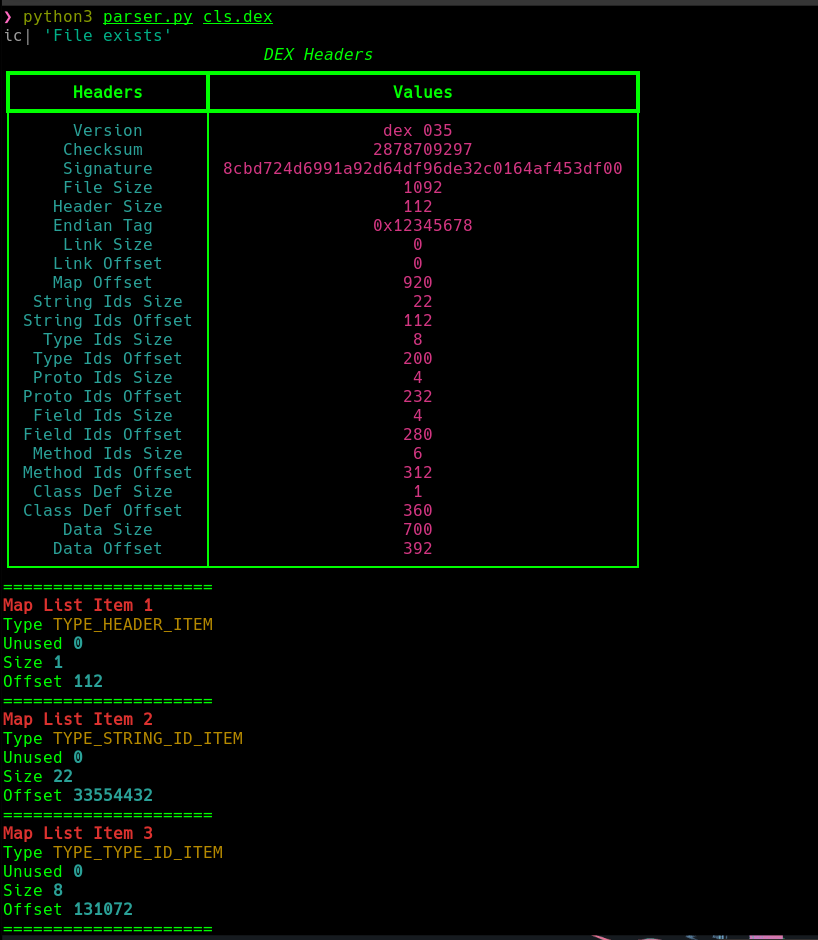
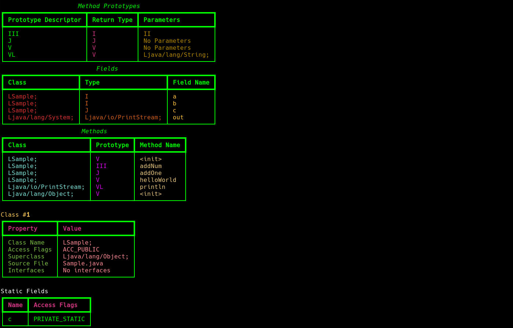
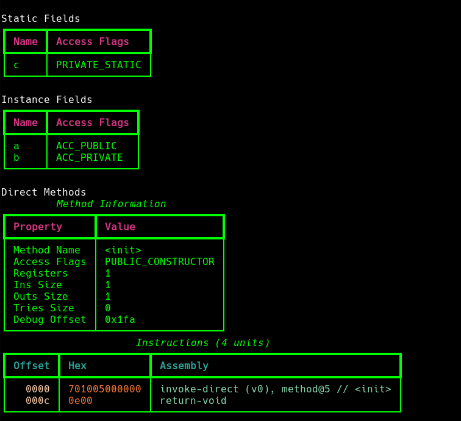

### Installation

```sh
git clone https://github.com/xk0m1/Dex-Parser.git
cd Dex-Parser
pip3 install -r requirements.txt
python3 parser.py -h
```

### Screenshots






### Further Improvements

- Need to parse Instructions of each method. 
